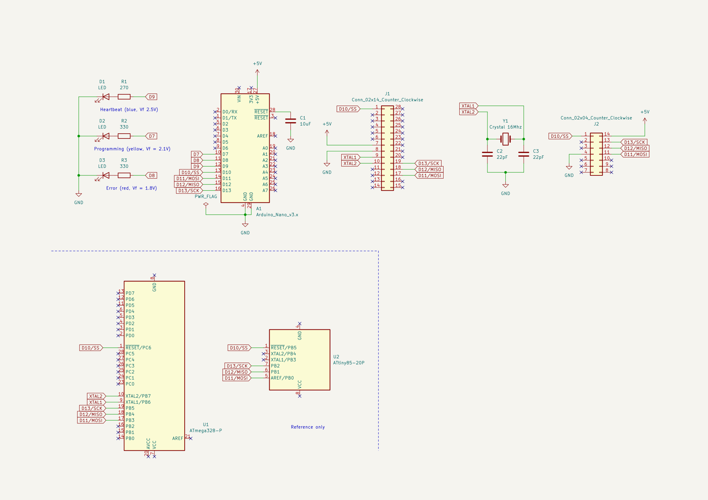

# AVR programmer

An AVR programmer for 8 pin DIP ATtiny chips and for 28 pin ATMega chips,
based on
["Arduino as ISP"](https://github.com/arduino/arduino-examples/tree/main/examples/11.ArduinoISP/ArduinoISP)
example from Arduino.

The programmer can be built on a 50mm x 70mm universal board.

The programmer can upload code (or set fuse) to:

* ATtiny DIP-8N chips, such as ATtiny85 and ATtiny13
* ATMega DIP-28N chips, such as ATmega328p

For ATmega328p, a crystal and capacitors provides external clocks to the MCU.

For DIP-20N package chips, such as
[ATtiny2313](https://www.microchip.com/en-us/product/ATtiny2313),
the on-board ISP pins on Arduino nano can be used (requires wires and a
breadboard).

Wiring requires polyurethane enameled wire or UEW. Insulated wires may be used
instead. UEW is also called "copper soldering wire", or "polyurethane enameled
wire" in Chinese online markets.

<!-- vim-markdown-toc GFM -->

* [Bill of material](#bill-of-material)
* [Schematic](#schematic)
* [Requirements](#requirements)
* [Building](#building)
* [Activating `tox` environment](#activating-tox-environment)
* [Uploading the firmware](#uploading-the-firmware)
* [Usage](#usage)
* [License](#license)

<!-- vim-markdown-toc -->

## Bill of material

See the kicad schematic for the details.

* Arduino_Nano_v3.x or a clone
* Female pin sockets for Arduino Nano
* 3 resistors
* 3 ceramic capacitors
* 3 LEDs (blue, yellow, and red)
* 2 ZIF (Zero insertion force) sockets (14 pin and 28 pin)
* A 16 Mhz crystal
* A double-sided universal board (50mm x 70mm)
* A roll of enameled copper wire, or insulated wires
* A roll of solder wire

If ZIF sockets are not available, they can be replaced with DIP sockets (not
recommended, though).

## Schematic



## Requirements

* python 3 and [tox](https://tox.wiki/en/latest/install.html)
* [kicad](https://www.kicad.org/) (optional, but strongly recommended)

## Building

`tox.ini` installs all the dependencies, including `platformio` and necessary
toolchains, and builds the code.

```console
tox
```

## Activating `tox` environment

In `tox` environment, you can run `platformio`.

```console
source .tox/python/bin/activate
```

```console
> pio --version
PlatformIO Core, version 6.1.3
```

To build, run:

```console
pio run
```

## Uploading the firmware

Before uploading the firmware, the Arduino Nano must be removed from the
board because a capacitor in the circuit prevents the Nano from resetting.

To upload the code, run:

```console
pio run -t upload --upload-port ${SERIAL_PORT}
```

Replace `${SERIAL_PORT}` with the serial port on local machine.
`/dev/ttyUSB${N}` for Linux, `/dev/cuaU${N}` for FreeBSD, `COM${N}` for
Windows.

Then, place the Nano back to the circuit.

When connected to the machine and the Nano boots, the LEDs flash, and the blue
LED grows.

## Usage

Insert the chip into one of ZIF socket. The pin near the lever (top left) is
pin 1. Connect the programmer to the machine.

For Arduino, choose "Arduino as ISP" as programmer.

See [test/platformio.ini](test/platformio.ini) for `platformio` settings.

## License

BSD-2-Clause. See [ArduinoISP.ino](src/ArduinoISP.ino) and
[LICENSE.md](LICENSE.md).
